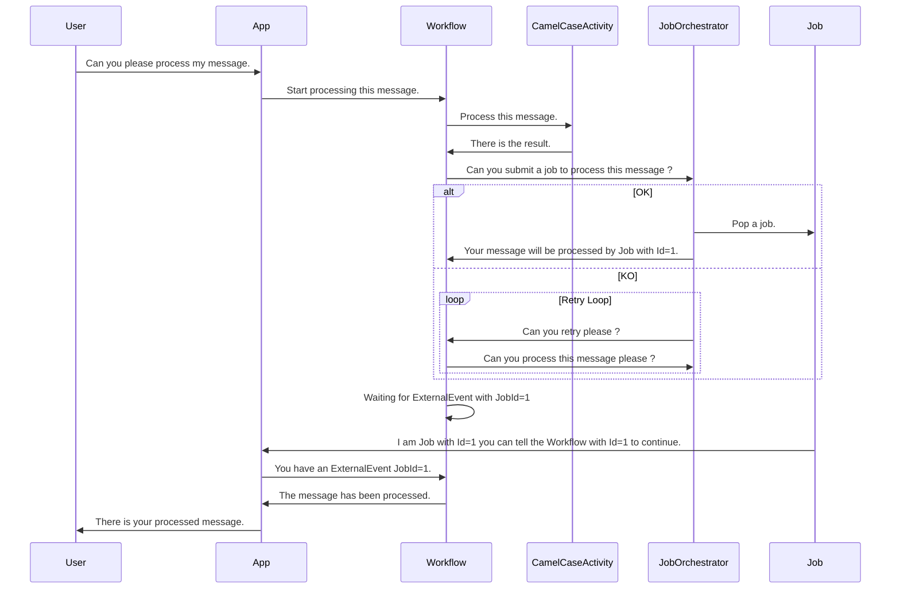

## Features
- Orchestrates activities through [Dapr Workflow](https://docs.dapr.io/developing-applications/building-blocks/workflow/workflow-overview/).
- Executes one external job to demonstrate external workloads (locally on Docker, but in production with K8S on specific job).

## Usage
1. Create a Docker network:
   ```bash
   docker network create workflow-network
   ```
2. Bring up the containers:
   ```bash
   docker compose up -d
   ```
3. View logs:
   ```bash
   docker compose logs -f
   ```

## Explaination

The idea is to use Workflow to orchestrate some external k8s job in order to process compute in a cost-optimized way. Let say the job is running under GPU we can spawn k8s job on these particular node for compute time only and release the node after the job done by leverage k8s autoscalling.

There is a quick sequence diagram of the actual POC :



We are using ID as `ExternalEvent` to ensure uniqueness of a job, we can easily imagine launching N job at the same time to parallelise the work and wait for all of them to be completed before resuming the workflow.